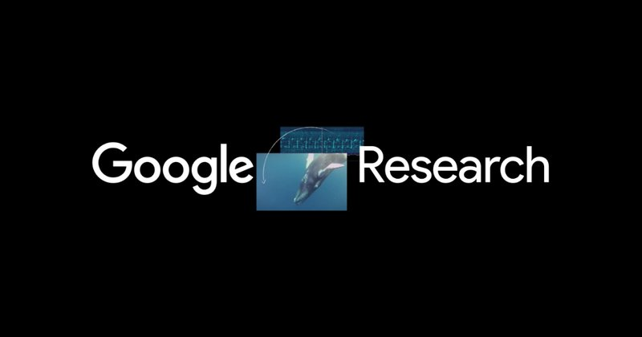

Abdoulaye Diack works as a Senior Program Manager at [Google AI](https://research.google/teams/africa-team/) 🤖 in Accra, where he contributes to AI research and talent development initiatives. With 5 years in AI/ML and a background in engineering and management, he focuses on projects that aim to benefit Africa and other developing regions. 

Abdoulaye's recent work includes using AI to improve mapping in underserved areas, supporting African NLP research, and exploring AI applications in healthcare for resource-limited settings. Originally from Senegal, he is bilingual in French and English.

Abdoulaye studied Computer Science at Concordia University in Montreal and previously worked on projects at Google Brain 🧠. As a father of two, he's motivated to explore how AI can address practical challenges in developing countries. Occasionally, Abdoulaye participates in public speaking events to share insights from his work in the field.

# Interests

 - Artificial Intelligence
 - Machine Learning
 - Computer Science
 - Research + innovation + startups in Africa
 - Digital transformation & AI Africa Ecosystem

# Resources 

|  |  |
|--|--|
| **Self Learning** |
| - [Machine Learning Crash Course](https://developers.google.com/machine-learning/crash-course) |
| - [Kaggle Courses](https://www.kaggle.com/learn) |
| - [ML on Coursera](https://www.coursera.org/learn/machine-learning) |
| - [ML Learning by Jean de Nyandwi](https://github.com/Nyandwi/machine_learning_complete/) |
| **Education** |
| - [African Masters of Machine Intelligence](https://aimsammi.org/) |
| - [CMU Africa - MS EAI ](https://www.africa.engineering.cmu.edu/academics/programs/mseai.html) |
| **Research Community** |
| - [Data Science Africa](http://www.datascienceafrica.org/) |
| - [Machine Learning and Data Science Africa](https://groups.google.com/g/mlds-africa?pli=1) |
| - [Black In AI](https://blackinai.github.io/#/) |
| - [Indaba Deep Learning](https://deeplearningindaba.com/) |
| - [ML Collective](https://mlcollective.org/) |
| - [Global Center on AI Governance](https://www.globalcenter.ai/) |
| **Startups** |
| - [GFSA: AI First (Africa) - Google for Startups Accelerator](https://startup.google.com/programs/accelerator/ai-first/africa/) |
| - [NVDIA Inception program for startups](https://www.nvidia.com/en-us/startups/) |
| - [ARM for startups](https://www.arm.com/markets/startups) |
| - [Google Black Founders Fund](https://startup.google.com/programs/black-founders-fund/africa/) |
| - [Google for Startups Africa](https://startup.google.com/accelerator/africa/) |
| - [Startups for Sustainable Development](https://events.withgoogle.com/startups-for-sustainable-development/) |
| - [Mozilla Ventures](https://mozilla.vc/) |
| - [Flapmax](https://flapmax.com/africa/fast-accelerator/) |
| - [Lacuna Fund](https://lacunafund.org/)| 
| - [216 Capital](https://216capital.vc/)|
| - [Partech](https://partechpartners.com/)|
| - [Villgro Africa](https://villgroafrica.org/)|
| **Engineering & Software Development** |
| - [Google for developers - AI development](https://developers.google.com/focus/ai-development) |
| - [Google Cloud ML & AI courses](https://cloud.google.com/learn/training/machinelearning-ai) |
| - [Google AI & ML architecture](https://cloud.google.com/architecture/ai-ml) |

# Work

Abdoulaye works on research talent building programs and AI projects in Africa.

|  |  |
|--|--|
| | As a Program Manager I work with a talented team of Research scientists and engineers. I also work on dtrengthening research @ labs, Startups and Universities in Africa through various Google and partners programs [Google Research Africa site, Ghana ](https://research.google/teams/africa-team/)|
| |Mapping the world with AI   Using cutting edge applied AI with a research team of Software engineer and scientists we work improve maps in Africa and the rest of the world [open source the footprint](https://sites.research.google/open-buildings/) |
| Speaker | Abdoulaye, a polyglot speaker fluent in English and French, is an international speaker who tackles various topics related to Africa's development in the field of Artificial Intelligence (AI). His talks delve into applied AI research, engineering, generative AI, the growth of tech startups, and fostering local talent in the AI space.|

# News & Publications

|  |  | |
|--|--|--|
|Blog |[Open Buildings: AI-powered maps for a changing world](https://blog.google/technology/research/open-buildings-ai-powered-maps-for-a-changing-world/)||
|Article |[Chez Google, Abdoulaye Diack, nouvel artisan d’une IA « made in Africa »](https://www.jeuneafrique.com/1600061/economie-entreprises/chez-google-abdoulaye-diack-nouvel-artisan-dune-ia-made-in-africa/#:~:text=Open%20Buildings%20et%20les%20langues,nous%20%C2%BB%2C%20explique%20le%20manager)||
|Interview |[Les langues africaines intègrent Google Traduction](https://youtu.be/ncR8AIvLBT4?si=kSqrEC3_ZHH35qth)||
|Interview |[Google Traduction intègre plus de 110 nouvelles langues • FRANCE 24](https://youtu.be/7-_D2iXvRrs?si=z9a_NCshMJHZvtJW)||
|Panel |[Boosting Africa’s Transformation through Education, Science, Technology & Innovation](https://www.uneca.org/eca-events/africa-business-forum-2024)||
|Paper |[Development and Evaluation of Deep Learning Models for Cardiotocography Interpretation](https://www.medrxiv.org/content/10.1101/2024.03.05.24303805v1)||
|AI and Research talk|[✨Naviguer à l'ère de l'IA : Défis et Opportunités pour les Chercheurs et Innovateurs](https://www.linkedin.com/posts/friareafrica_friare-ia-webinairefriare-activity-7185653374162210816-8JRh?utm_source=share&utm_medium=member_desktop)||
|Paper |[High-Resolution Building and Road Detection from Sentinel-2](https://arxiv.org/pdf/2310.11622.pdf)||
|Podcast |[Google & African Business Club - L'intelligence Artificielle en Afrique : quels enjeux et perspectives?](https://podcasters.spotify.com/pod/show/africanbusinesstalks/episodes/Google--African-Business-Club---Lintelligence-Artificielle-en-Afrique--quels-enjeux-et-perspectives---avec-Abdoulaye-Diack--Resarch-Program-Manager--Google-AI-e2dm7qr/a-aapf9h3)(French)|)|
|Keynote |[[Re:learn] Sous le capot de l'IA, un peu de vulgarisation](https://youtu.be/Ny10bfdqSW0?si=ar_Kt8LgqHGzcUbK&t=1902)(French)||
|AI Talk | [Rencontre avec Abdoulaye Diack: Intelligence Artificeille, quels enjeux et perspectives en Afrique](https://www.linkedin.com/posts/african-business-club_ia-intelligenceartificielle-talents-activity-7138829771752239104-cBEO?utm_source=share&utm_medium=member_desktop) |  |
|Keynote | [SSA Student Summit - Keynote](https://www.youtube.com/live/guixEsMb3vo?feature=share&t=565) |  |
|Panel | [Africa AI Impact Summit - ACHIEVING THE PROMISE OF AI IN AFRICA](https://www.youtube.com/live/GU_e2N1klow?si=S_hymFLu76dBZYez&t=5770) |  |
|Blog | [How mapping the world’s buildings makes a difference](https://blog.google/around-the-globe/google-africa/how-mapping-the-worlds-buildings-makes-a-difference/) ||
Panel Host - Namibia 4IR Conference |[A Panel on 4IR technologies and research](https://4irnamibia.com/4ir-conference/)  | |
|Blog | [Using AI to map Africa’s buildings](https://blog.google/around-the-globe/google-africa/using-ai-to-map-africas-buildings/) ||
CNN Interview |  [How Ghana's rising tech scene is getting even bigger](https://edition.cnn.com/videos/business/2021/10/15/marketplace-africa-ghana-tech-google-uber-meqasa-spc.cnn)  | |
BBC Interview |  [Google releases buildings and structure datasets for Africa promises progress in mapping, planning and addresses.](https://www.bbc.co.uk/programmes/p09qnk4d)  | |
Panel Host - AMLD Africa |[NLP and the African context featuring Instadeep and Rural Sense -AI & NLP](https://www.youtube.com/watch?v=MXCbp5t_q_Q&list=PLyyHDYyFFpkBSUmX-iv7JLgeNJHvRIt4M&index=17)  | |
 
